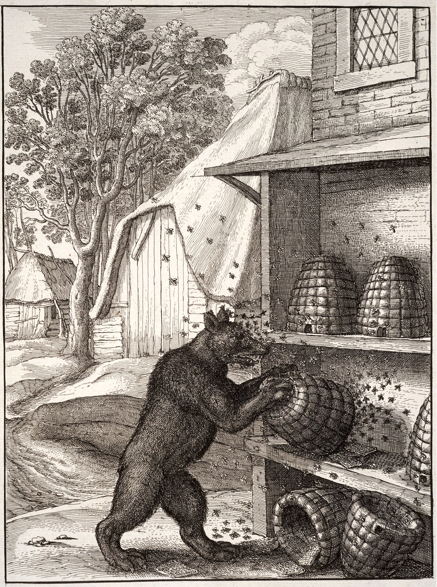

# hery 🐻
🐻 Hierarchical Entity Relational YAML (HERY) 🐻

HERY is an extension to [YAML](https://yaml.org/), leveraging the concept of entities—[YAML](https://yaml.org/)
groupings that can be interconnected similarly to an RDBMS. This CLI utility facilitates the use of HERY, enabling
efficient data organization and interaction.

Additionally, the term "hery" in British English, pronounced /ˈhɛrɪ/, is an obsolete verb meaning "to glorify; praise."
This name reflects the utility's aim to elevate and celebrate structured data management.

## Install
### Build
```bash
go build -o hery
```

## Quickstart
To verify that it was installed properly:
```bash
hery --version
```

### Create a collection
```bash
hery collection init collection_name
```

### List collections
```bash
hery collection list
```

### Download an entity
```bash
# Without version it will get the latest version or if no version found then it will generate a pseudo version number using the commit hash
# To add a version: @v{version}
hery entity --collection amadla get github.com/Repository/EntityName
```

### Query
```bash
hery entity --collection {collection name} query 'entities'
```

### More...
To get more details on the functioning and commands: [.docs](.docs).

## Dev
### IDE Plugins
        [Vim](.editor/.vimrc)

        [Visual Studio Code](.editor/code.yml) - ([GitHub](https://github.com/AmadlaOrg/hery-code-editor-plugin))

        [JetBrains](.editor/jetbrains.yml) - ([GitHub](https://github.com/AmadlaOrg/hery-jetbrains-editor-plugin))

        [Zed](.editor/zed.yml) - ([GitHub](https://github.com/AmadlaOrg/hery-zed-editor-plugin))

        [Sublime Text](.editor/sublime.yml) - ([GitHub](https://github.com/AmadlaOrg/hery-sublime-editor-plugin))

        [GNU Emacs](.editor/emacs.yml) - ([GitHub](https://github.com/AmadlaOrg/hery-emacs-editor-plugin))

        [Brackets](.editor/brackets.yml) - ([GitHub](https://github.com/AmadlaOrg/hery-brackets-editor-plugin))

        [Atom](.editor/atom.yml) - ([GitHub](https://github.com/AmadlaOrg/hery-atom-editor-plugin))

### Create Entity
1. Create repository
2. Make a dot directory with the collection name at the root of the repository:
   - `mkdir -p .<collection name>`
3. Make `.hery` configuration file with the collection name at the root of the repository
   - `touch <collection name>.hery`
4. Make a `schema.json` configuration file in the `.<collection name>` directory
   - `touch ./.<collection name>/schema.json`
5. Add the content in `.hery` configuration file and the `schema.json` [JSON-Schema](https://json-schema.org/)
6. Add it in git:
   - `git add .`
   - `git commit -m "Batman"`

### Manage Tag Versioning
Steps to add a tag:
```bash
git tag -a v1.0.0-alpha.1
git push --tags
```

### Entity version numbering
HERY follows the same [versioning standard as Golang](https://go.dev/doc/modules/version-numbers).

| Version stage                         | Example                                                              | Description                                                                                                                                                       |
|---------------------------------------|----------------------------------------------------------------------|-------------------------------------------------------------------------------------------------------------------------------------------------------------------|
| In development                        | Automatic pseudo-version number `v0.0.0-20170915032832-14c0d48ead0c` | Indicates that the module is currently **in development and is considered unstable**. This release does not offer backward compatibility or stability assurances. |
| Major version                         | `v1.x.x`                                                             | Indicates **public API changes that are not backward-compatible**. This release does not guarantee compatibility with previous major versions.                    |
| Minor version                         | `vx.4.x`                                                             | Indicates **public API changes that are backward-compatible**. This release guarantees both backward compatibility and stability.                                 |
| Patch version                         | `vx.x.1`                                                             | Indicates **changes that do not impact the module's public API or its dependencies**. This release ensures backward compatibility and stability.                  |
| Pre-release version (alpha, beta, rc) | `vx.x.x-beta.2`                                                      | Indicates that this is a **pre-release milestone, such as an alpha or beta version**. This release does not offer any stability guarantees.                       |

### Giving Credit
The `.pairs` file is a great way to add details about the people that contributed to the entity. There is one used in
this repository that can be used as reference.

### Check dependencies
Useful to check that libraries for testing and development don't find themselves in the build version of the project:
```bash
go list -f '{{.Deps}}' ./main.go
```

> TODO: Create a script to blacklist certain libraries.
> Also useful for security.

## ©️ Copyright
- "[The Bear and Honey.](https://www.flickr.com/photos/97123293@N07/29003630251)" by [Swallowtail Garden Seeds](https://www.flickr.com/photos/97123293@N07) is marked with [Public Domain Mark 1.0](https://creativecommons.org/publicdomain/mark/1.0/?ref=openverse).

## :scroll: License

The license for the code and documentation can be found in the [LICENSE](./LICENSE) file.

---

Made in Québec 🏴󠁣󠁡󠁱󠁣󠁿, Canada 🇨🇦!
